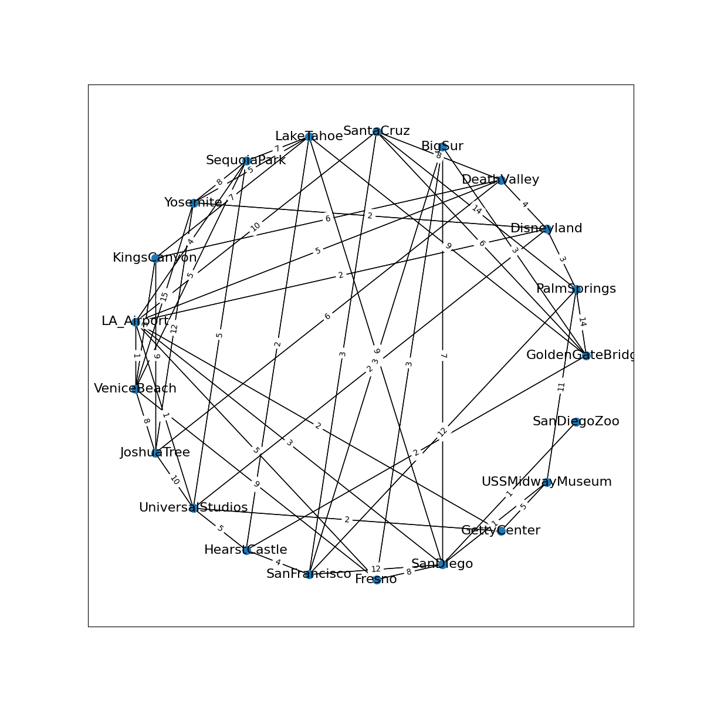
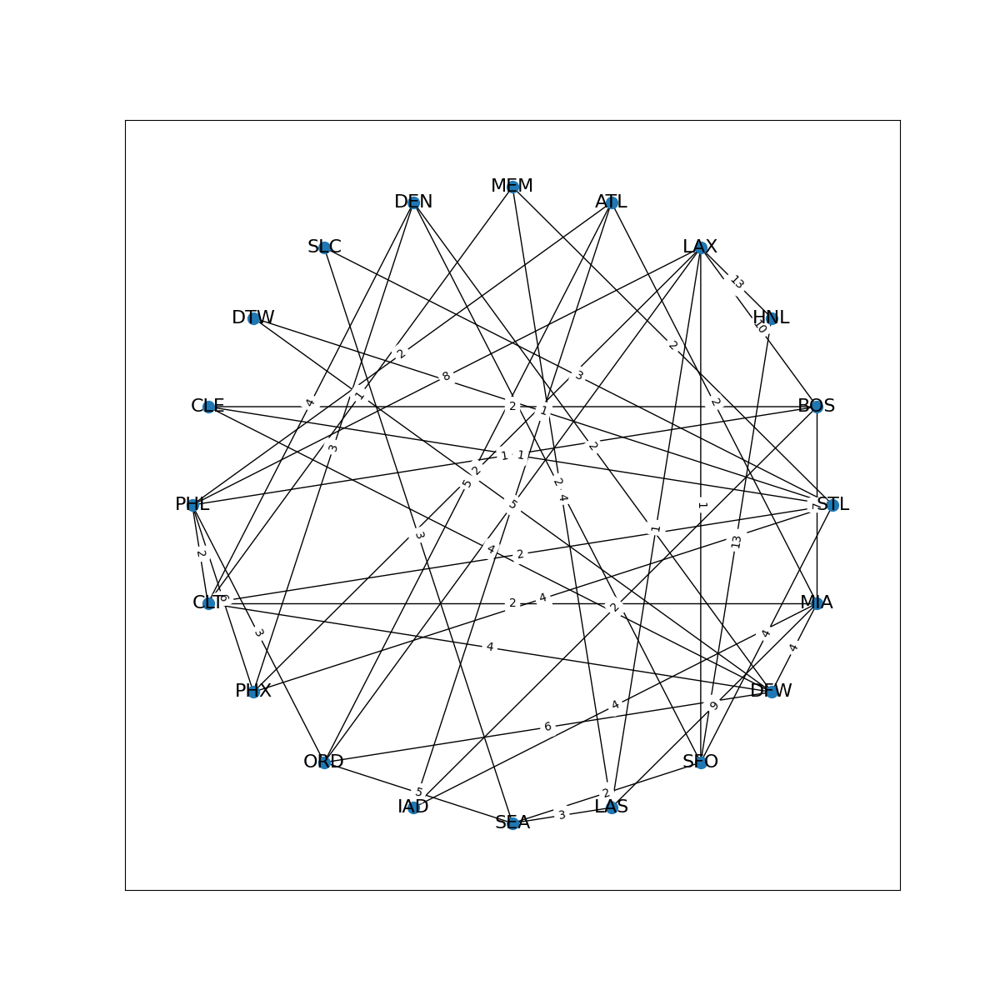
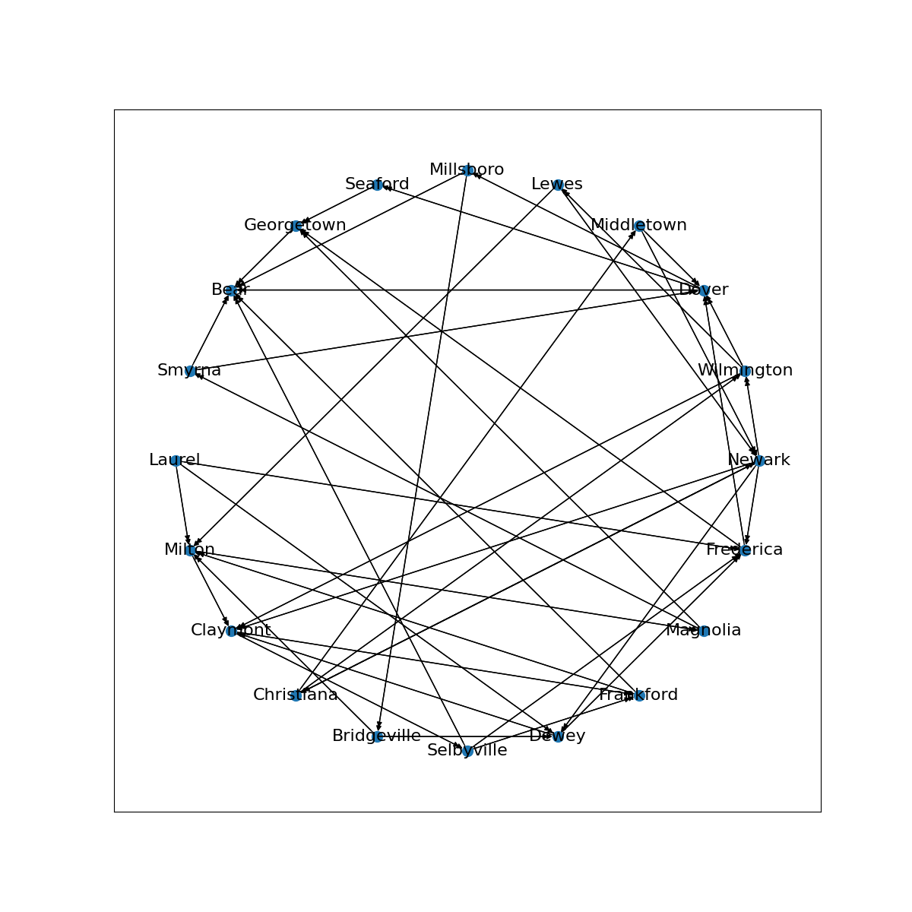
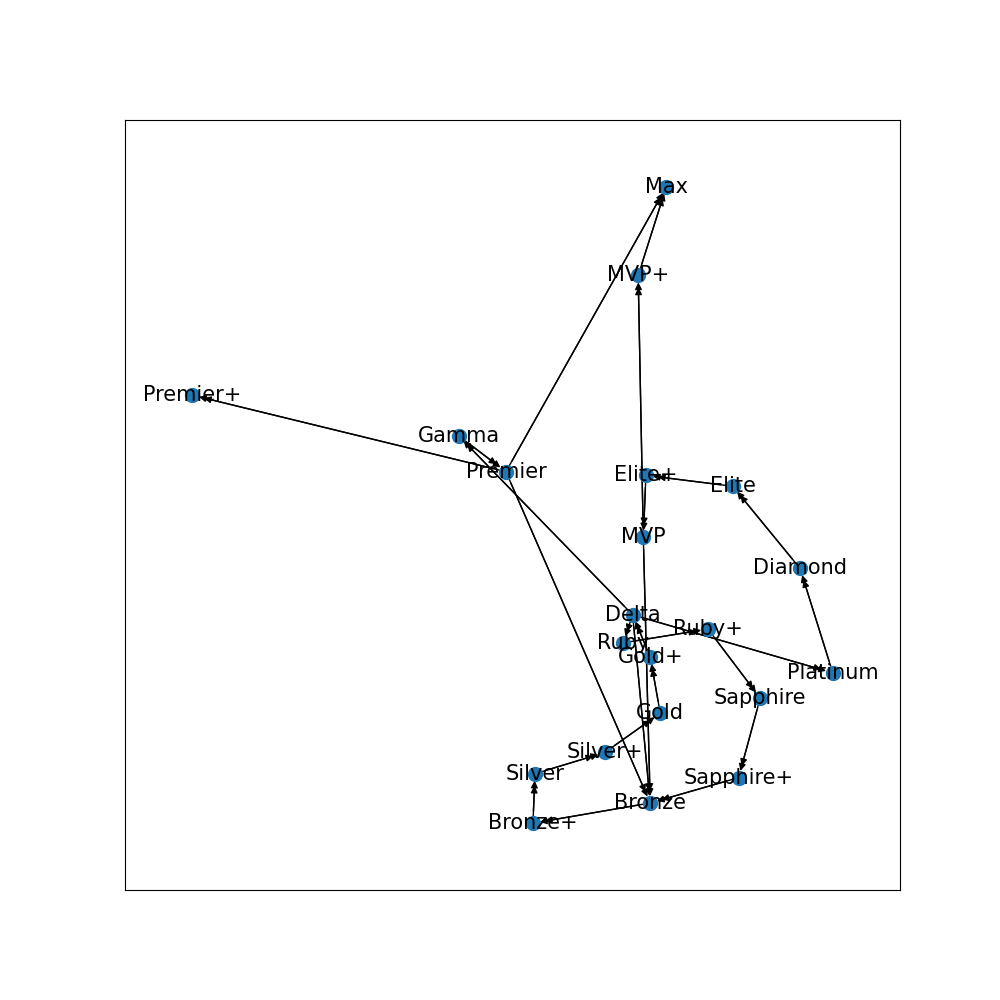

# Transportations

**CISC320 Spring 2023 Lesson 14 - Graph Applications**

Group Members:
* Paul Kearney (paulke@udel.edu)
* Jon O'Connell (jjoc@udel.edu)
* Daniel DeFlores (deflores@udel.edu)
* Pranav Kamath (pkama@udel.edu)

Description of project

Our project heavily revolves around modes of transportation. This is what we all gravitated towards when we were thinking
of real world applications of graphing algorithms. 

## Installation Code

```sh
$> pip install networkx
```

## Python Environment Setup

```python
import networkx as nx
```

# Busing in CA
**Informal Description**: 
A tour bus company based in LA wants to map out new routes and want to stop as often as possible to
pick up new travelers, but also stop at every popular tourist destination. in order to do this, the tour bus 
company wants to pick routes such that the bus drives on the shortest road to get to each location.

> **Formal Description**:
>  * Input: An undirected graph of tourist destinations. edges being roads that connect destinations,vertices 
>  * the destinations themselves.
>  * Output: minimum spanning tree of tourist destinations

**Graph Problem/Algorithm**: MST


**Setup code**:

```python
edges = []
with open("tourist_destinations.txt") as data_file:
    lines: list[str]
    lines = data_file.readlines()
edgeList = lines[1:]
destinations = nx.Graph()
for edge in edgeList:
    edges.append(edge.split(","))
for edge in edges:
    test = edge[2]
    destinations.add_edge(edge[0], edge[1], weight=int(edge[2]))
pos = nx.circular_layout(destinations)
plt.figure(20,figsize=(12,12))
labels = nx.get_edge_attributes(destinations,'weight')
nx.draw_networkx(destinations,pos, node_size=100, font_size=16)
nx.draw_networkx_edge_labels(destinations,pos,edge_labels=labels)
plt.savefig("graph_for_prims.png")
```
**Visualization**:



**Solution code:**

```python
solution = nx.minimum_spanning_tree(destinations,algorithm="prim")
print(solution.edges(data=True))

```

**Output**
```
[('GoldenGateBridge', 'BigSur', {'weight': 3}), ('GoldenGateBridge', 'HearstCastle', {'weight': 2}),
('PalmSprings', 'Disneyland', {'weight': 3}), ('Disneyland', 'LA_Airport', {'weight': 2}),
('Disneyland', 'Yosemite', {'weight': 2}), ('Disneyland', 'DeathValley', {'weight': 4}),
('DeathValley', 'JoshuaTree', {'weight': 6}), ('BigSur', 'Fresno', {'weight': 3}),
('BigSur', 'SanFrancisco', {'weight': 3}), ('SantaCruz', 'SanFrancisco', {'weight': 3}),
('LakeTahoe', 'HearstCastle', {'weight': 2}), ('SequoiaPark', 'LA_Airport', {'weight': 4}), 
('KingsCanyon', 'VeniceBeach', {'weight': 3}), ('LA_Airport', 'VeniceBeach', {'weight': 1}), 
('LA_Airport', 'UniversalStudios', {'weight': 1}), ('LA_Airport', 'GettyCenter', {'weight': 2}),
('LA_Airport', 'SanDiego', {'weight': 3}), ('LA_Airport', 'Fresno', {'weight': 5}), ('SanDiego',
'USSMidwayMuseum', {'weight': 1}), ('SanDiego', 'SanDiegoZoo', {'weight': 1})]


```

**Interpretation of Results**:
LA seems to be a great location for the tour bus company as it is around so many attractions and there are many
short roads connected to the LA airport. The buses can stop often to bring in new customers and drop off
customers who already paid with these new routes.


# Travel Company Troubles
**Informal Description**: 
A travel company wants to streamline what flights they give to their customers. After too many complaints about 
giving long travel days to their clients, they want to now send people to their destination the quickest way.
Regardless of how, they want to send their clients to the destination as fast as they can. If an Atlanta Falcons fan
wants to go to Las Vegas to see the Raiders play, which flights should the airline give them?

> **Formal Description**:
>  * Input: An undirected graph of airports, edges being flight paths that connect terminals,vertices are 
>  * the airports themselves.
>  * Output: The shortest path from the source to the final destination, in this case ATL to LAS.
**Graph Problem/Algorithm**: SSSP


**Setup code**:

```python
import networkx as nx
import matplotlib.pyplot as plt
graph = {"PHL":{"LAX": {'weight': 8}, "CLT": {'weight': 2}, "PHX":{'weight': 6},
                "ORD": {'weight': 3},"ATL":{'weight':2},"BOS":{"weight":1}},
          "CLT": {"MIA":{"weight":2},"STL":{"weight":2},"DFW":{"weight":4},
                  "MEM":{"weight":1},"DEN":{"weight":4}},
          "PHX": {"LAX": {'weight': 2},"DEN":{"weight":3},"STL":{"weight":4}},
          "ORD": {"LAX": {"weight": 5},"DFW":{"weight":6}, "ATL":{"weight":5}},
          "IAD": {"BOS":{"weight":2},"ATL":{"weight":3}},
          "SEA": {"LAS": {'weight': 3}, "SFO":{'weight':2}, "SLC":{"weight":3},
                  "ORD":{'weight':5}},
          "LAS": {"LAX":{"weight":1}, "MIA":{"weight":9},"MEM":{"weight":4}},
          "SFO":{"LAX":{"weight":1},"DEN":{'weight':2},"STL":{"weight":4},},
          "DFW":{"DEN":{"weight":2},"MIA":{"weight":4},"DTW":{"weight":5},
                 "CLE":{"weight":4}},
          "MIA":{"ATL":{"weight":2},"IAD":{"weight":4},"BOS":{"weight":7}},
          "STL":{"MEM":{"weight":2},"SLC":{"weight":3}, "DTW":{"weight":1},
                 "CLE":{"weight":1}},
          "BOS":{"LAX":{"weight":10},"CLE":{"weight":5},"CLE":{"weight":2}},
          "HNL": {"LAX":{"weight":13},"SFO":{"weight":13}}
          }
G = nx.from_dict_of_dicts(graph)

pos = nx.shell_layout(G)
labels = nx.get_edge_attributes(G,'weight')
plt.figure(1,figsize=(12,12)) 
nx.draw_networkx(G,pos, node_size=100, font_size=16)
nx.draw_networkx_edge_labels(G,pos,edge_labels=labels)
```
**Visualization**:


**Solution code:**

```python
djikstra = nx.dijkstra_path(G,"ATL","LAS", weight='weight')
print(djikstra)

```

**Output**
```
['ATL', 'PHL', 'CLT', 'MEM', 'LAS']
```

**Interpretation of Results**:
The resulting list is an order set of vertices giving the shortest path from the source to the destination.
For this problem, that is the shortest flight path from Atlanta(ATL) to Las Vegas(LAS).

# Train Scheduling
**Informal Description**:
The local train station has been struggling with business lately because many travelers can't reach their desired destinations-- some of the train tracks don't connect to certain places due to some one way tracks. To better serve customers, the manager of the station wants to double check which spots are reachable depending on the location of departure.

**Formal Description**:
 * Input: 
    * A directed graph, with the edges being tracks, and the vertices being destinations.
 * Output: All connected vertices for each node

 **Graph Problem/Algorithm**: BFS

 **Setup Code**:
 ```python
import networkx as nx
import matplotlib.pyplot as plt

# Initialize the graph
possible_destinations = nx.DiGraph()

# Add each destination as a vertex on the graph
stops_as_nodes = open("train_stops.txt")
stops_as_nodes = stops_as_nodes.read().split()
for node in stops_as_nodes:
    possible_destinations.add_node(node)

# Add each train track/route as an edge in the graph
stops_as_edges = open("train_routes.txt")
stops_as_edges = stops_as_edges.read().split()
i = 0
for edge in stops_as_edges:
    stops_as_edges[i] = edge.split(",")
    i+=1
for edge in stops_as_edges:
    possible_destinations.add_edge(edge[0],edge[1])

# Create a visualization of the graph
pos = nx.circular_layout(possible_destinations)
plt.figure(20,figsize=(12,12))
nx.draw_networkx_edges(possible_destinations, pos)
nx.draw_networkx(possible_destinations,pos, node_size=100, font_size=16)
plt.savefig("graph_for_bfs.png")
```
**Visualization**:



**Solution Code**:
```python
# Output the result
for destination in possible_destinations:
    print(destination + ": ", end="")
    connected_stops = dict(nx.bfs_successors(possible_destinations, destination))
    for stop in connected_stops:
        print(",".join(list(connected_stops[stop])) + ",", end="")
    print()
```

**Output**:
* Newark: Wilmington,Claymont,Christiana,Frederica,Dewey,Dover,Lewes,Frankford,Selbyville,Middletown,Georgetown,Bear,Seaford,Millsboro,Milton,Bridgeville,Magnolia,Smyrna,
* Wilmington: Dover,Claymont,Lewes,Bear,Seaford,Millsboro,Frankford,Selbyville,Milton,Newark,Georgetown,Bridgeville,Frederica,Magnolia,Christiana,Dewey,Smyrna,Middletown,
* Dover: Bear,Seaford,Millsboro,Georgetown,Bridgeville,Dewey,Milton,Frederica,Claymont,Magnolia,Frankford,Selbyville,Smyrna,
* Middletown: Dover,Newark,Bear,Seaford,Millsboro,Wilmington,Claymont,Christiana,Frederica,Dewey,Georgetown,Bridgeville,Lewes,Frankford,Selbyville,Milton,Magnolia,Smyrna,      
* Lewes: Milton,Newark,Claymont,Magnolia,Wilmington,Christiana,Frederica,Dewey,Frankford,Selbyville,Georgetown,Smyrna,Dover,Middletown,Bear,Seaford,Millsboro,Bridgeville,      
* Millsboro: Bear,Bridgeville,Dewey,Milton,Frederica,Claymont,Magnolia,Georgetown,Dover,Frankford,Selbyville,Smyrna,Seaford,
* Seaford: Georgetown,Bear,
* Georgetown: Bear,
* Bear: ,
* Smyrna: Bear,Dover,Seaford,Millsboro,Georgetown,Bridgeville,Dewey,Milton,Frederica,Claymont,Magnolia,Frankford,Selbyville,
* Laurel: Frederica,Dewey,Milton,Georgetown,Dover,Claymont,Magnolia,Bear,Seaford,Millsboro,Frankford,Selbyville,Smyrna,Bridgeville,
* Milton: Claymont,Magnolia,Frankford,Selbyville,Georgetown,Smyrna,Bear,Frederica,Dover,Seaford,Millsboro,Bridgeville,Dewey,
* Claymont: Frankford,Selbyville,Bear,Milton,Frederica,Magnolia,Georgetown,Dover,Smyrna,Seaford,Millsboro,Bridgeville,Dewey,
* Christiana: Newark,Wilmington,Middletown,Claymont,Frederica,Dewey,Dover,Lewes,Frankford,Selbyville,Georgetown,Bear,Seaford,Millsboro,Milton,Bridgeville,Magnolia,Smyrna,      
* Bridgeville: Dewey,Milton,Frederica,Claymont,Magnolia,Georgetown,Dover,Frankford,Selbyville,Smyrna,Bear,Seaford,Millsboro,
* Selbyville: Bear,Frankford,Frederica,Milton,Georgetown,Dover,Claymont,Magnolia,Seaford,Millsboro,Smyrna,Bridgeville,Dewey,
* Dewey: Frederica,Claymont,Georgetown,Dover,Frankford,Selbyville,Bear,Seaford,Millsboro,Milton,Bridgeville,Magnolia,Smyrna,
* Frankford: Bear,Milton,Claymont,Magnolia,Selbyville,Georgetown,Smyrna,Frederica,Dover,Seaford,Millsboro,Bridgeville,Dewey,
* Magnolia: Georgetown,Smyrna,Bear,Dover,Seaford,Millsboro,Bridgeville,Dewey,Milton,Frederica,Claymont,Frankford,Selbyville,
* Frederica: Georgetown,Dover,Bear,Seaford,Millsboro,Bridgeville,Dewey,Milton,Claymont,Magnolia,Frankford,Selbyville,Smyrna,

**Interpretation of Results**:
The resulting dictionary contains key value pairs for each node and its respective list of other nodes that it is connected to. 
That is, which destinations can be accessed from a given train departure location. Each key value pair is output.

# Rewards Program Tiers
**Informal Description**:
The new flight rewards program has been designed to provide its customers with greater benefits as they progress through its various tiers. Each tier offers more significant advantages than the previous one. The retailer has established a total of 20 tiers in its rewards program, starting from Bronze and moving all the way up to the highest tier, MVP+. To help our customers, we want to show how they can advance quickly through our tier system paths. Furthermore, paths exist within the graphwe have an exploit where cycles lets our customers take advantage of our system, so we implemented a way to detect it. 

**Formal Description**:
 * Input: 
    * A directed graph, with the nodes/vertices being tiers.
 * Output1: A dictionary representing the possible paths and A list of cycles in the graph

 **Graph Problem/Algorithm**: DFS

 **Setup Code**:
```python
import networkx as nx
import matplotlib.pyplot as plt

# Initializes the graph
tierGraph = nx.DiGraph()

# Adds each tier vertex on the graph reading from the node file
tier_nodes = open("rewards_tiers.txt")
tier_nodes = tier_nodes.read().split()

for node in tier_nodes:
    tierGraph.add_node(node)

# Add each edge in the graph from another file in the form : node1 -> node2 = node1,node2
tier_edges = open("rewards_tiers_edges.txt")
tier_edges = tier_edges.read().split()
i = 0
for edge in tier_edges:
    tier_edges[i] = edge.split(",")
    i+=1
for edge in tier_edges:
    tierGraph.add_edge(edge[0],edge[1])


# Create a visualization of the graph
pos = nx.spring_layout(tierGraph)
plt.figure(15,figsize=(10,10))
nx.draw_networkx_edges(tierGraph, pos)
nx.draw_networkx(tierGraph,pos, node_size=100, font_size=15)
plt.savefig("graph_for_dfs.png")

```
**Visualization**:



 **Solution Code**
``` python
for node in tierGraph:
    print(node + ": ", end="")
    node_connections = dict(nx.dfs_successors(tierGraph, node))
    for stop in node_connections:
        print(" -> ".join(list(node_connections[stop])) + " -> ", end="")
    print("\n")

print("------------------------------------------------------------------"+"\n")

# check for cycles in the graph
def find_cycles(graph):
    cycles = []
    visited = set()

    def dfs(node, path):
        visited.add(node)

        for neighbor in graph.neighbors(node):
            if neighbor not in visited:
                dfs(neighbor, path + [neighbor])
            elif neighbor == path[0]:
                cycles.append(path + [neighbor])

    for node in graph.nodes():
        dfs(node, [node])

    return cycles

cycles = find_cycles(tierGraph)

print the cycles found
print("Cycles in the graph:")
for cycle in cycles:
    print(cycle)

```

**Output**

* Bronze: Bronze+ -> Silver -> Silver+ -> Gold -> Gold+ -> Delta -> Ruby -> Platinum -> Gamma -> Ruby+ -> Sapphire -> Sapphire+ -> Diamond -> Elite -> Elite+ -> MVP -> MVP+ -> Max -> Premier -> Premier+ -> 

* Bronze+: Silver -> Silver+ -> Gold -> Gold+ -> Delta -> Ruby -> Platinum -> Gamma -> Ruby+ -> Sapphire -> Sapphire+ -> Bronze -> Diamond -> Elite -> Elite+ -> MVP -> MVP+ -> Max -> Premier -> Premier+ -> 

* Silver: Silver+ -> Gold -> Gold+ -> Delta -> Ruby -> Platinum -> Gamma -> Ruby+ -> Sapphire -> Sapphire+ -> Bronze -> Bronze+ -> Diamond -> Elite -> Elite+ -> MVP -> MVP+ -> Max -> Premier -> Premier+ -> 

* Silver+: Gold -> Gold+ -> Delta -> Ruby -> Platinum -> Gamma -> Ruby+ -> Sapphire -> Sapphire+ -> Bronze -> Bronze+ -> Silver -> Diamond -> Elite -> Elite+ -> MVP -> MVP+ -> Max -> Premier -> Premier+ -> 

* Gold: Gold+ -> Delta -> Ruby -> Platinum -> Gamma -> Ruby+ -> Sapphire -> Sapphire+ -> Bronze -> Bronze+ -> Silver -> Silver+ -> Diamond -> Elite -> Elite+ -> MVP -> MVP+ -> Max -> Premier -> Premier+ ->   

* Gold+: Delta -> Ruby -> Platinum -> Gamma -> Ruby+ -> Sapphire -> Sapphire+ -> Bronze -> Bronze+ -> Silver -> Silver+ -> Gold -> Diamond -> Elite -> Elite+ -> MVP -> MVP+ -> Max -> Premier -> Premier+ ->   

* Delta: Ruby -> Platinum -> Gamma -> Ruby+ -> Sapphire -> Sapphire+ -> Bronze -> Bronze+ -> Silver -> Silver+ -> Gold -> Gold+ -> Diamond -> Elite -> Elite+ -> MVP -> MVP+ -> Max -> Premier -> Premier+ ->   

* Ruby: Ruby+ -> Sapphire -> Sapphire+ -> Bronze -> Bronze+ -> Silver -> Silver+ -> Gold -> Gold+ -> Delta -> Platinum -> Gamma -> Diamond -> Elite -> Elite+ -> MVP -> MVP+ -> Max -> Premier -> Premier+ ->   

* Ruby+: Sapphire -> Sapphire+ -> Bronze -> Bronze+ -> Silver -> Silver+ -> Gold -> Gold+ -> Delta -> Ruby -> Platinum -> Gamma -> Diamond -> Elite -> Elite+ -> MVP -> MVP+ -> Max -> Premier -> Premier+ ->   

* Sapphire: Sapphire+ -> Bronze -> Bronze+ -> Silver -> Silver+ -> Gold -> Gold+ -> Delta -> Ruby -> Platinum -> Gamma -> Ruby+ -> Diamond -> Elite -> Elite+ -> MVP -> MVP+ -> Max -> Premier -> Premier+ ->   

* Sapphire+: Bronze -> Bronze+ -> Silver -> Silver+ -> Gold -> Gold+ -> Delta -> Ruby -> Platinum -> Gamma -> Ruby+ -> Sapphire -> Diamond -> Elite -> Elite+ -> MVP -> MVP+ -> Max -> Premier -> Premier+ ->   

* Platinum: Diamond -> Elite -> Elite+ -> MVP -> Bronze -> MVP+ -> Bronze+ -> Silver -> Silver+ -> Gold -> Gold+ -> Delta -> Ruby -> Gamma -> Ruby+ -> Sapphire -> Sapphire+ -> Premier -> Premier+ -> Max ->   

* Diamond: Elite -> Elite+ -> MVP -> Bronze -> MVP+ -> Bronze+ -> Silver -> Silver+ -> Gold -> Gold+ -> Delta -> Ruby -> Platinum -> Gamma -> Ruby+ -> Sapphire -> Sapphire+ -> Premier -> Premier+ -> Max ->   

* Elite: Elite+ -> MVP -> Bronze -> MVP+ -> Bronze+ -> Silver -> Silver+ -> Gold -> Gold+ -> Delta -> Ruby -> Platinum -> Gamma -> Ruby+ -> Sapphire -> Sapphire+ -> Diamond -> Premier -> Premier+ -> Max ->   

* Elite+: MVP -> Bronze -> MVP+ -> Bronze+ -> Silver -> Silver+ -> Gold -> Gold+ -> Delta -> Ruby -> PlatMVP+: Max ->

* Max:

------------------------------------------------------------------

* Cycles in the graph:
* ['Bronze', 'Bronze+', 'Silver', 'Silver+', 'Gold', 'Gold+', 'Delta', 'Ruby', 'Ruby+', 'Sapphire', 'Sapphire+', 'Bronze']
* ['Bronze', 'Bronze+', 'Silver', 'Silver+', 'Gold', 'Gold+', 'Delta', 'Platinum', 'Diamond', 'Elite', 'Elite+', 'MVP', 'Bronze']
* ['Bronze', 'Bronze+', 'Silver', 'Silver+', 'Gold', 'Gold+', 'Delta', 'Gamma', 'Premier', 'Bronze']     
* ['Bronze', 'Bronze+', 'Silver', 'Silver+', 'Gold', 'Gold+', 'Delta', 'Bronze']


 **Interpretation of Results**:
The code generates a graph representing a rewards program, where each tier is represented by a node in the graph. Using depth-first enables the company to traverse the graph and print out the nodes in the order they were visited.
There are also cycles in the graph, which indicate that it is possible to loop back to previous tiers in the rewards program.
