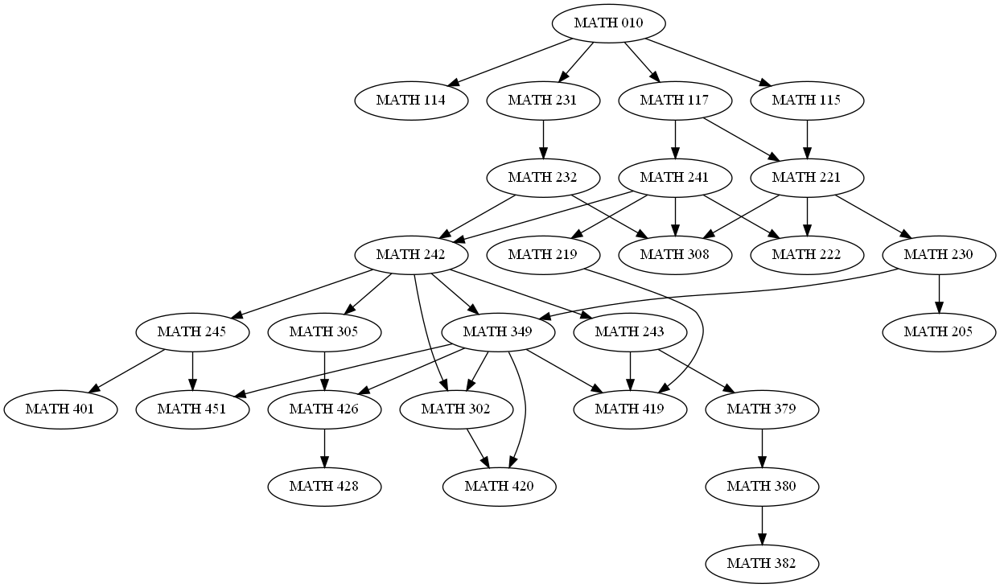
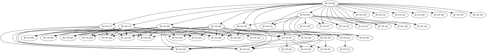
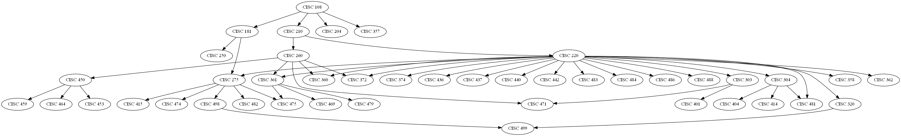
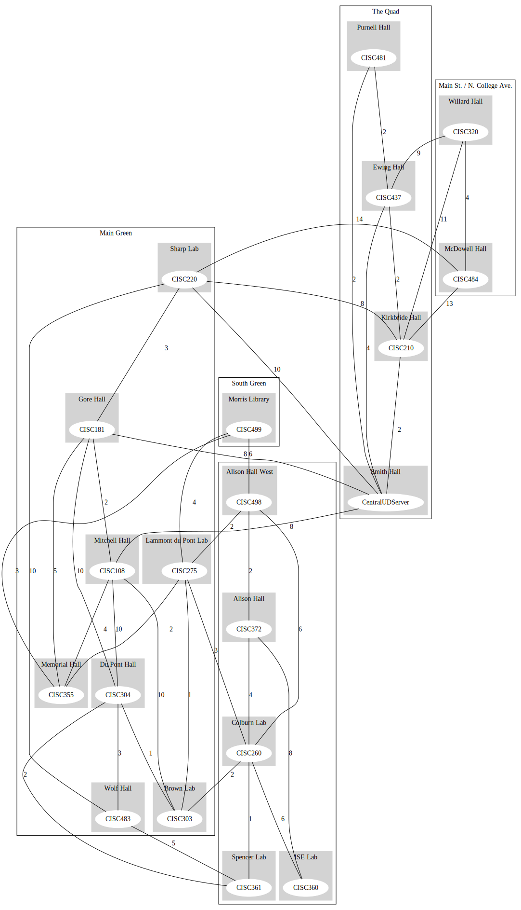
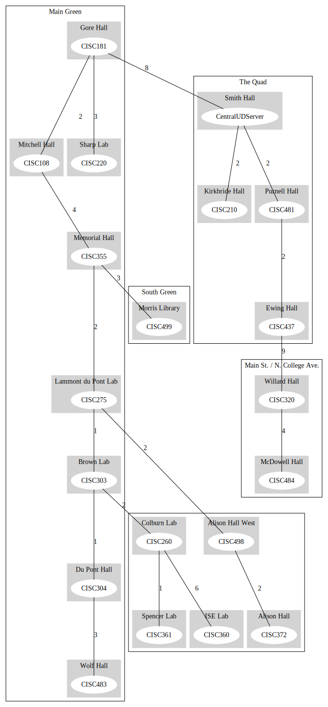

# UD course related graphs

**CISC320 Spring 2023 Lesson 19 - Graph Applications**

Group Members:
* Leon Giang (philong@udel.edu)
* ebrignac@udel.edu 
* jfmarks@udel.edu
* Patrick Brady (pbrady@udel.edu)

Creating various related graphs for use in creative problem-solving algorithms utilizing python's popular networkx library.

## Installation Code

```sh
$> pip install networkx
```

## Python Environment Setup

```python
import networkx as nx
```


# BFS - Finding Courses Given a Prerequisite

**Informal Description**: BFS problem that enables you to find all the courses which list your given course as a prereq. Essentially, you can find what courses you can now take given you have taken the specified course.

> **Formal Description**: Given a Course ID, find all of its direct children.
>  * Input: A Course ID, with a space between the course and its number, and an adjacency dictionary that lists each node as keys and their parents as values.
>  * Output: The direct children of the Course ID. If there are no children, returns a message informing the user that no courses list the given course as a prereq. If the node does not exist, returns a networkx error indicating that the node could not be found.

**Graph Problem/Algorithm**: [BFS]


**Setup code**:

```python
def build_graph_from_dict(parents_dict):
    # Create an empty directed graph
    graph = nx.DiGraph()

    # Add all nodes to the graph
    nodes = parents_dict.keys()
    graph.add_nodes_from(nodes)

    # Add edges between nodes and their parents
    for node, parents in parents_dict.items():
        for parent in parents:
            graph.add_edge(parent, node)

    return graph

parents_dict = {
    "MATH 010" : [],
    "MATH 114" : ['MATH 010'],
    "MATH 115" : ['MATH 010'],
    "MATH 221" : ['MATH 115', 'MATH 117'],
    "MATH 222" : ['MATH 221', 'MATH 241'],
    "MATH 230" : ['MATH 221'],
    "MATH 205" : ['MATH 210', 'MATH 230'],
    "MATH 349" : ['MATH 230', 'MATH 242'],
    "MATH 302" : ['MATH 242', 'MATH 349', 'MATH 351'],
    "MATH 420" : ['MATH 302', 'MATH 349', 'MATH 350'],
    "MATH 419" : ['MATH 219', 'MATH 243', 'MATH 349', 'MATH 350'],
    "MATH 426" : ['MATH 305', 'MATH 351', 'MATH 349'],
    "MATH 428" : ['MATH 426', 'MATH 353'],
    "MATH 451" : ['MATH 349', 'MATH 245'],
    "MATH 308" : ['MATH 221', 'MATH 232', 'MATH 241'],
    "MATH 117" : ['MATH 010'],
    "MATH 241" : ['MATH 117'],
    "MATH 219" : ['MATH 241'],
    "MATH 242" : ['MATH 241', 'MATH 232'],
    "MATH 243" : ['MATH 242'],
    "MATH 379" : ['MATH 243'],
    "MATH 380" : ['MATH 379'],
    "MATH 382" : ['MATH 380'],
    "MATH 245" : ['MATH 210', 'MATH 242'],
    "MATH 401" : ['MATH 245'],
    "MATH 305" : ['MATH 242'],
    "MATH 231" : ['MATH 010'],
    "MATH 232" : ['MATH 231'],
}

G = build_graph_from_dict(parents_dict)

```

**Visualization**:



**Solution code:**

```python
def find_direct_children(graph, source):
    # Create a BFS tree starting from the source node
    bfs_tree = nx.bfs_tree(graph, source, depth_limit=1)
    
    # Creates an empty list to contain the children of the node
    children = []
    
    # Loops through every node in bfs_tree. Since the max depth is 1, every node is the child of the source.
    for node in bfs_tree:
        if node != source:
            children.append(node)
    
    # If the source node has no children, return a message
    if not children:
        return "There are no other courses that have the one you entered as a prereq!"
    return children
```

**Output**

```
Please enter a course. You must enter a course ID following the example format: "MATH 242"
The BFS algorithm will determine what courses you can take once you have completed the course you entered: MATH 242
Here are the courses you can take now:
['MATH 349', 'MATH 302', 'MATH 243', 'MATH 245', 'MATH 305']
```

**Interpretation of Results**: Given that you have taken MATH 242, the courses that you can now take are MATH 349, MATH 302, MATH 243, MATH 245, and MATH 305. These courses list MATH 242 as a prereq and, now that you have taken MATH 242, you are now able to enroll in these courses.


# Using SSSP to find the easiest class

**Informal Description**:
Joe needs to figure out what the easiest path of prerequisites can be taken to get to ECON 490

> **Formal Description**:
>  * Input: 'ECON 101', 'ECON 490', and the ECON course graph
>  * Output: (['ECON 101', 'ECON 251', 'ECON 490'], 'weight = 4')

**Graph Problem/Algorithm**: [SSSP]


**Setup code**:

```python
    # the dictionary containing the adjacency for the graph
    adjacency_dict = {"ECON 101": [],
                      "ECON 103": ['ECON 101'],
                      "ECON 308": ['ECON 103'],
                      "ECON 251": ['ECON 101'],
                      "ECON 255": ['ECON 101'],
                      "ECON 300": ['ECON 101'],
                      "ECON 301": ['ECON 101'],
                      "ECON 303": ['ECON 103', 'ECON 251', 'ECON 255', 'ECON 300', 'ECON 301'],
                      "ECON 419": ['ECON 303'],
                      "ECON 304": ['ECON 103', 'ECON 301'],
                      "ECON 430": ['ECON 303', 'ECON 304'],
                      "ECON 435": ['ECON 303', 'ECON 304'],
                      "ECON 364": ['ECON 300', 'ECON 301'],
                      "ECON 408": ['ECON 251', 'ECON 255', 'ECON 300', 'ECON 301'],
                      "ECON 418": ['ECON 251', 'ECON 255', 'ECON 300', 'ECON 301'],
                      "ECON 426": ['ECON 251', 'ECON 255', 'ECON 300', 'ECON 301'],
                      "ECON 433": ['ECON 251', 'ECON 255', 'ECON 300', 'ECON 301'],
                      "ECON 436": ['ECON 251', 'ECON 255', 'ECON 300', 'ECON 301', 'ECON 303', 'ECON 304'],
                      "ECON 441": ['ECON 251', 'ECON 255', 'ECON 300', 'ECON 301'],
                      "ECON 443": ['ECON 251', 'ECON 255', 'ECON 300', 'ECON 301', 'ECON 303', 'ECON 304'],
                      "ECON 444": ['ECON 251', 'ECON 300', 'ECON 301'],
                      "ECON 460": ['ECON 301'],
                      "ECON 463": ['ECON 251', 'ECON 300', 'ECON 301'],
                      "ECON 483": ['ECON 251', 'ECON 255', 'ECON 300', 'ECON 301'],
                      "ECON 490": ['ECON 251', 'ECON 255', 'ECON 300', 'ECON 301'],
                      "ECON 306": ['ECON 101', 'ECON 103'],
                      "ECON 406": ['ECON 251', 'ECON 255', 'ECON 300', 'ECON 301', 'ECON 306'],
                      "ECON 410": ['ECON 251', 'ECON 255', 'ECON 300', 'ECON 301', 'ECON 306'],
                      "ECON 422": ['ECON 300', 'ECON 301', 'ECON 306'],
                      "ECON 423": ['ECON 422'],
                      "ECON 311": ['ECON 101', 'ECON 103'],
                      "ECON 315": ['ECON 101', 'ECON 103'],
                      "ECON 316": ['ECON 101', 'ECON 103'],
                      "ECON 317": ['ECON 101', 'ECON 103'],
                      "ECON 320": ['ECON 101'],
                      "ECON 321": ['ECON 101', 'ECON 103'],
                      "ECON 332": ['ECON 101'],
                      "ECON 340": ['ECON 101', 'ECON 103'],
                      "ECON 342": ['ECON 101', 'ECON 103'],
                      "ECON 343": ['ECON 101'],
                      "ECON 360": ['ECON 101'],
                      "ECON 381": ['ECON 101'],
                      "ECON 385": ['ECON 101'],
                      "ECON 393": ['ECON 101'],
                      "ECON 415": ['ECON 101', 'ECON 103', 'ECON 306']}

    # blank graph initialized
    g = nx.DiGraph()
    counter = 0
    # loop through each dict key
    for node in adjacency_dict.keys():
        g.add_node(node)

        # loop through each adjacent node
        for adjacent_node in adjacency_dict[node]:
            counter += 1
            # add the edge between the node and the adjacent node
            g.add_edge(adjacent_node, node, weight=counter % 7)
            
```

**Visualization**:

 

**Solution code:**

```# the source and destination must be formatted as 'ECON ###' with an existing course #
def find_path(source: str, destination: str, g: nx.DiGraph):
    if nx.has_path(g, source=source, target=destination):
        solution = nx.shortest_path(g, source=source, target=destination, weight='weight')
        return solution, "weight = " + str(nx.path_weight(g, solution, weight='weight'))
    else:
        return "No Path"
```

**Output**

```
(['ECON 101', 'ECON 251', 'ECON 490'], 'weight = 4')
```

**Interpretation of Results**: the shortest_path function in the nx library uses Dijkstra's algorithm by default to find the shortest path from one node to another node.


# Using DFS to find the lowest CISC course number in the graph

**Informal Description**:
Bob wants to find the easiest computer science course. Foolishly, Bob thinks that the easiest course is the one with the lowest Course ID.

> **Formal Description**:
>  * Input: 'CISC 499', and the CISC course graph
>  * Output: CISC 108

**Graph Problem/Algorithm**: [DFS/BFS/SSSP/APSP/MST]
    DFS

**Setup code**:

```python
   adjacency_dict = {
'CISC 108': [],
'CISC 181': ['CISC 108'],
'CISC 250': ['CISC 181'],
'CISC 275': ['CISC 181', 'CISC 220'],
'CISC 415': ['CISC 275'],
'CISC 474': ['CISC 275'], 
'CISC 475': ['CISC 275', 'CISC 361'],
'CISC 482': ['CISC 275'], 
'CISC 498': ['CISC 275'],
'CISC 499': ['CISC 320', 'CISC 498'],
'CISC 204': ['CISC 108'], 
'CISC 210': ['CISC 108'],
'CISC 220': ['CISC 210'],
'CISC 303': ['CISC 220'],
'CISC 401': ['CISC 303'], 
'CISC 471': ['CISC 260', 'CISC 303'],
'CISC 304': ['CISC 220'],
'CISC 404': ['CISC 304'],
'CISC 414': ['CISC 304'],
'CISC 481': ['CISC 220', 'CISC 304'], 
'CISC 320': ['CISC 220'], 
'CISC 358': ['CISC 220'],
'CISC 360': ['CISC 220', 'CISC 260'],
'CISC 361': ['CISC 220', 'CISC 260'],
'CISC 469': ['CISC 361'],
'CISC 479': ['CISC 361'],
'CISC 362': ['CISC 220'],
'CISC 372': ['CISC 220', 'CISC 260'],
'CISC 374': ['CISC 220'],
'CISC 436': ['CISC 220'],
'CISC 437': ['CISC 220'],
'CISC 440': ['CISC 220'],
'CISC 442': ['CISC 220'],
'CISC 483': ['CISC 220'],
'CISC 484': ['CISC 220'],
'CISC 486': ['CISC 220'],
'CISC 488': ['CISC 220'], 
'CISC 260': ['CISC 210'],
'CISC 450': ['CISC 260'],
'CISC 453': ['CISC 450'],
'CISC 459': ['CISC 450'],
'CISC 464': ['CISC 450'],
'CISC 357': ['CISC 108']}

import networkx as nx

G = nx.DiGraph(adjacency_dict)


```

**Visualization**:

 

**Solution code:**

```python
# the source and destination must be formatted as 'ECON ###' with an existing course #
def find_easiest_course(course):
    # Find the easiest course in the graph
    # The easiest course == the course with the lowest course number


    # Perform depth-first search to search all nodes of depth 2
    dfs_edges = nx.dfs_edges(G, course)

    # Print the edges visited during the depth-first search
    
    m = int(course[-3:])
    for edge in dfs_edges:
        print(edge)
        if int(edge[0][-3:]) < m:
            m = int(edge[0][-3:])
        if int(edge[1][-3:]) < m:
            m = int(edge[1][-3:])
    return 'CISC ' + str(m)
```

**Output**

```
CISC 108
```

**Interpretation of Results**:
	The Depth first search algorith scans over all of the nodes in the graph so we can use
    it to find the node with the smallest course number. 


# Calculating Minimum Networking Cost using a Minimum Spanning Tree

**Informal Description**: 
    In a drastic turn of funding and enrollment, the University of Delaware has approved building 20 new computer science 
    labs in certain buildings around campus, with each lab designated for a specific subset of the CISC-coded courses. 
    Unfortunately, due to outdated technology (or perhaps at the request of Dr. Roosen and Dr. Silber) each of these labs
    must be networked directly to the Central UD CISC Server (this defintely exists) at Smith Hall. The problem is to 
    determine the minimum cost for connecting all of the new Labs to the central server and map out this solution. On 
    the map, each line indicates how much it would cost to dig a tunnel to lay the networking cable required to connect 
    each building, or add cable to existing tunnels. (Note: it costs A LOT to dig through the middle of the Green). UD 
    already had to do that once a few years ago, we aren't ruining any more senior pictures!). A cost of 1 on the map 
    translates to $10,000. The map is attatched below.
> **Formal Description**:
>  * Input: CISC Course Graph (V, E), defined by the image below
>  * Output: (A Minimum Spanning Tree of CISC Course Graph, Total Cost $590,000 (i.e. total edge weight = 59))

**Graph Problem/Algorithm**: [MST]


**Setup code**:

```python
import networkx as nx
lab_map = nx.Graph()
edges = []
with open('edge-list.txt') as file:
    lines = file.readlines()
    for line in lines:
        line = line.strip()
        nodes = line.split(' ')
        node0 = nodes[0]
        node1 = nodes[2]
        weight = nodes[3].split("\"")[1]
        edges.append((node0, node1, int(weight)))

print(edges)
lab_map.add_weighted_edges_from(edges)
print(lab_map)
```

**Visualization**:



**Solution code:**

```python
mst = nx.tree.minimum_spanning_edges(lab_map, algorithm='prim', data=True)
edge_list = list(mst)
sorted_edge_list = sorted(edge_list)
[print(edge) for edge in sorted_edge_list] #preformatted output
sum = 0
for edge in sorted_edge_list:
    sum += edge[2]['weight']
print("Total weight is: " + str(sum))
print("Total cost is: " + str(sum*10000))
formatted_output_to_graphviz = [(str(edge[0]) + " -- " + str(edge[1]) + " [label=\"" + str(edge[2]['weight']) + "\"];") for edge in sorted_edge_list]
with open(r'mst-edge-list', 'w') as file:
    for line in formatted_output_to_graphviz:
        file.write("%s\n" % line)
```

**Output**

```
    ('CISC108', 'CISC181', {'weight': 2})
    ('CISC108', 'CentralUDServer', {'weight': 8})
    ('CISC181', 'CISC220', {'weight': 3})
    ('CISC260', 'CISC360', {'weight': 6})
    ('CISC260', 'CISC361', {'weight': 1})
    ('CISC275', 'CISC355', {'weight': 2})
    ('CISC275', 'CISC498', {'weight': 2})
    ('CISC303', 'CISC260', {'weight': 2})
    ('CISC303', 'CISC275', {'weight': 1})
    ('CISC303', 'CISC304', {'weight': 1})
    ('CISC304', 'CISC483', {'weight': 3})
    ('CISC320', 'CISC484', {'weight': 4})
    ('CISC355', 'CISC108', {'weight': 4})
    ('CISC355', 'CISC499', {'weight': 3})
    ('CISC437', 'CISC320', {'weight': 9})
    ('CISC481', 'CISC437', {'weight': 2})
    ('CISC498', 'CISC372', {'weight': 2})
    ('CentralUDServer', 'CISC210', {'weight': 2})
    ('CentralUDServer', 'CISC481', {'weight': 2})
    Total weight is: 59
    Total cost is: 590000
```

**Interpretation of Results**:
```
A minimum spanning tree that links all of the newly created CISC Labs
    and the main server contains the following nodes:
    ('CISC108', 'CISC181')
    ('CISC108', 'CentralUDServer')
    ('CISC181', 'CISC220')
    ('CISC260', 'CISC360')
    ('CISC260', 'CISC361')
    ('CISC275', 'CISC355')
    ('CISC275', 'CISC498')
    ('CISC303', 'CISC260')
    ('CISC303', 'CISC275')
    ('CISC303', 'CISC304')
    ('CISC304', 'CISC483')
    ('CISC320', 'CISC484')
    ('CISC355', 'CISC108')
    ('CISC355', 'CISC499')
    ('CISC437', 'CISC320')
    ('CISC481', 'CISC437')
    ('CISC498', 'CISC372')
    ('CentralUDServer', 'CISC210')
    ('CentralUDServer', 'CISC481')
    An image of the final Minimum Spanning Tree is attached below,
    with a total weight of 59, which translates to a total cost for the project
    of $590,000.
```
