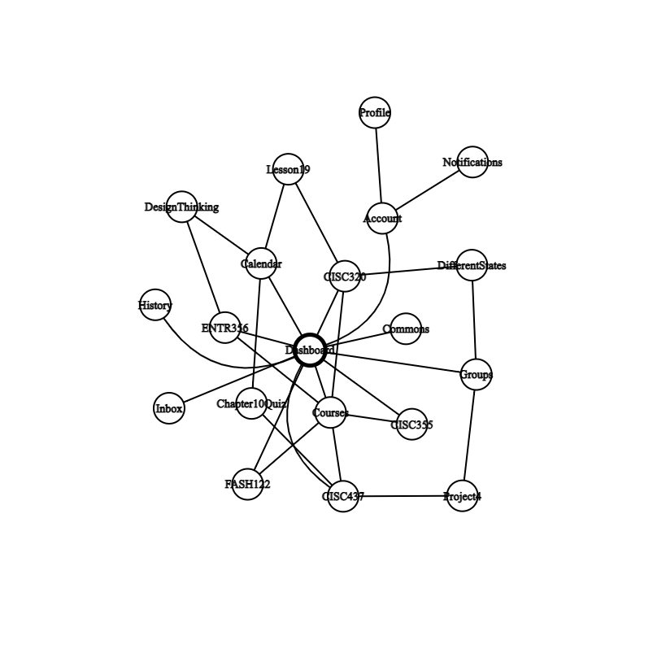

# Internet Networks and Information

**CISC320 Spring 2023 Lesson 14 - Graph Applications**

Group Members:
* Christian Kuhn  (kuhnc@udel.edu)
* Madeline Pearce (mpearce@udel.edu)
* Third member (email)
* Fourth member (email)

The theme of our project is "Internet networks and Information" we will use various graph algorithms to explore our Professor's website pages and subpages!

 
## Installation Code

```sh
$> pip install networkx
$> pip install matplotlib


```

## Python Environment Setup

```python
import networkx as nx
import matplotlib.pyplot as plt

```

# Website Page Traversal
**DFS Page Traversal**: We will explore the entirety of our Professor, Dr.Bart's, website! Given a list of pages as edges, we will create a graph and use a Depth First Search traversal to visit every page on the website.

> **Formal Description**:
>  * Input: An= directed graph of website pages and subpages 
>  * Output: List of all the pages we have visited 

**Graph Problem/Algorithm**: [DFS]


**Setup code**:

```
import networkx as nx
import matplotlib.pyplot as plt

# Define the edges
edges = [("https://acbart.github.io/", "/python-sneks/"),
         ("/python-sneks/", "learner_analysis.html"),
         ("/python-sneks/", "/course_faq.html"),
         ("/python-sneks/", "/assignments.html"),   
         ("https://acbart.github.io/", "/awards/"),
         ("https://acbart.github.io/", "/blog/"),
         ("https://acbart.github.io/", "/completed-projects/"),
         ("https://acbart.github.io/", "/contact/"),
         ("https://acbart.github.io/", "/potential-projects/"),
         ("https://acbart.github.io/", "/publications-and-posters/"),
         ("https://acbart.github.io/", "/sigcse-escapes-22/"),
         ("https://acbart.github.io/", "/sigcse-escapes-23/"),
         ("https://acbart.github.io/", "/students/"),
         ("https://acbart.github.io/", "/teaching-and-mentoring/"),
         ("https://acbart.github.io/", "/papers/"),
         ("/papers/Bart_CV.pdf", "/Bart_CV.pdf"),
         ("/python-sneks/", "python-sneks"),   
         ("python-sneks", "/tools.html"),         
         ("https://acbart.github.io/","runtime-case-builder/?preload=RCB_find_with_break_dynamic.json"),       
         ("python-sneks","/interventions.html"),    
         ("python-sneks","/guide_overview.html"),       
         ("python-sneks","/learner_analysis.html"),   
         ("python-sneks","/course_topics.html"),       
         ("python-sneks","/staff_roles.html"),       
         ("python-sneks","/tools.html"),
         ("python-sneks","/design_decisions.html"),
         ("python-sneks","/course_setup.html"),
         ("python-sneks","/module_guide.html"),
         ("python-sneks","/course_explanations.html"),
         ("python-sneks","/alternatives.html"),
         ("/teaching-and-mentoring/","/files/np-hard-infographic-kbagshaw-clique-cover.pdf"),
         ("/teaching-and-mentoring/","/files/np-hard-infographic-abobo-bridge-capacitated-minimum.png"),
         ("/papers/", "acbart-sigcse19-sneks.pdf"),
         ("/papers/","p160-gusukuma.pdf"),   
         ("/papers/","s03-gusukuma.pdf"),          
         ("/papers/","Bart_AC_D_2017.pdf"),      
         ("/papers/","dissertation-acbart-slides.pdf"),           
         ("/papers/","p66-bart-inroads.pdf"),     
         ("/papers/","acbart-sigcse17-corgis.pdf"),  
         ("/papers/","compsac-paper367.pdf"),           
         ("/papers/","blockpy-position-paper.pdf"),   
         ("/papers/","p63-kafura.pdf"),         
         ("/papers/","sigcse19-python-sneks.pdf")]

# Create a directed graph
G = nx.DiGraph()

# Add the edges to the graph
G.add_edges_from(edges)

# Draw the graph
pos = nx.spring_layout(G, seed=11, k = 2)
plt.figure(figsize=(10, 10))

nx.draw_networkx_nodes(G, pos, node_color="lightblue")
nx.draw_networkx_edges(G, pos, edgelist=edges[:45], width=.5, edge_color="black")
nx.draw_networkx_labels(G, pos, font_size=6, font_family="sans-serif")

plt.axis("off")
plt.show()


```

**Visualization**:


**Solution code:**

```
# Perform DFS traversal and print the nodes visited
visited = set()

def dfs(node):
    visited.add(node)
    print(node)
    for neighbor in G.neighbors(node):
        if neighbor not in visited:
            dfs(neighbor)
            
dfs("https://acbart.github.io/")
```

**Output**

```
https://acbart.github.io/
/python-sneks/
learner_analysis.html
/course_faq.html
/assignments.html
python-sneks
/tools.html
/interventions.html
/guide_overview.html
/learner_analysis.html
/course_topics.html
/staff_roles.html
/design_decisions.html
/course_setup.html
/module_guide.html
/course_explanations.html
/alternatives.html
/awards/
/blog/
/completed-projects/
/contact/
/potential-projects/
/publications-and-posters/
/sigcse-escapes-22/
/sigcse-escapes-23/
/students/
/teaching-and-mentoring/
/files/np-hard-infographic-kbagshaw-clique-cover.pdf
/files/np-hard-infographic-abobo-bridge-capacitated-minimum.png
/papers/
acbart-sigcse19-sneks.pdf
p160-gusukuma.pdf
s03-gusukuma.pdf
Bart_AC_D_2017.pdf
dissertation-acbart-slides.pdf
p66-bart-inroads.pdf
acbart-sigcse17-corgis.pdf
compsac-paper367.pdf
blockpy-position-paper.pdf
p63-kafura.pdf
sigcse19-python-sneks.pdf
runtime-case-builder/?preload=RCB_find_with_break_dynamic.json
```

**Interpretation of Results**:
The result of the DFS traversal is the order in which the nodes (web pages) of the website were visited. The traversal started at the root node, "https://acbart.github.io/", and then explored the nodes in depth-first order, visiting all the pages linked from each page before backtracking. The result shows the hierarchical structure of the website, with pages visited in a depth-first manner. This order can be useful for analyzing the website's structure and content.


**BFS Page Traversal**: We will explore the pages accessible through Canvas. The starting node is the Canvas dashboard. We will create a graph using Breadth First Traversal.

**Setup code**:
```
import networkx as nx
import matplotlib.pyplot as plt

# Define the edges
edges = [("Dashboard", "CISC437"),
         ("Dashboard", "CISC320"),
         ("Dashboard", "FASH122"),
         ("Dashboard", "CISC355"),
         ("Dashboard", "ENTR356")
         ("Dashboard", "Groups"),
         ("Dashboard", "Inbox"),
         ("Dashboard", "Account"),
         ("Dashboard", "Courses"),
         ("Dashboard", "Calendar"),
         ("Dashboard", "History")
         ("Dashboard", "Commons"),
         ("Courses", "CISC437"),
         ("Courses", "CISC320"),
         ("Courses", "FASH122"),
         ("Courses", "CISC355"),
         ("Courses", "ENTR356"),
         ("Account", "Notifications"),
         ("Account", "Profile"),
         ("Calendar", "Lesson 19"),
         ("Calendar", "Chapter 10 Quiz"),
         ("Calendar", "Design Thinking"),
         ("Design Thinking", "ENTR356"),
         ("Lesson 19", "CISC320"),
         ("Chapter 10 Quiz", "CISC437")
         ("Groups", "Project 4"),
         ("Groups", "Different States")
         ("Project 4", "CISC437")
         ("Different States", "CISC320")]
         

# Create a undirected graph
G = nx.Graph()

# Add the edges to the graph
G.add_edges_from(edges)
```

**Visualization**:



**Solution code:**
```
def bfs(visited: list, graph, node: str):
    visited.append(node)
    queue.append(node)
    
    while queue:
        x = queue.pop(0)
        print (x, end = " ")

    for neighbor in graph[x]:
        if neighbor not in visited:
            visited.append(neighbor)
            queue.append(neighbor)
```

**Interpretation of Results**: For my questions, the answer was too big to represent through one graph. Because of the workload of college classes, I couldn't include all of the assignments linked in every class. When I added the calendar node, I could have added 50+ nodes of more assignments, but instead just listed the assignments due on the same day as this one (apr 9). This was also my personal canvas page, so every graph would look different depending on the person and classes. This shows how large graphs can be and how much they can represent.