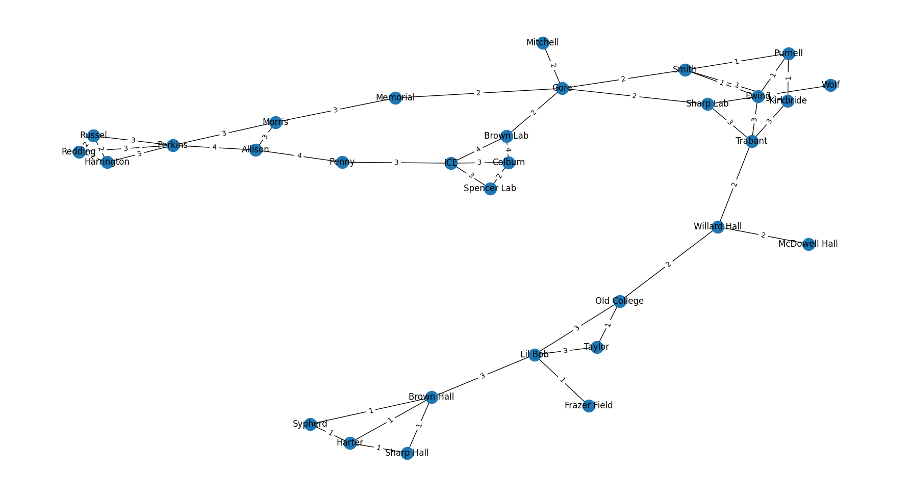
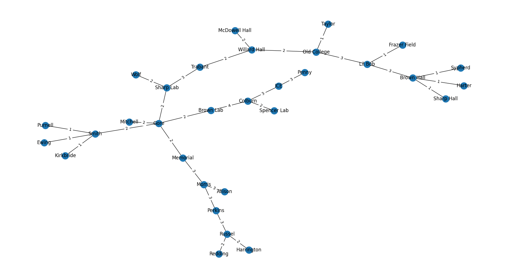

**CISC320 Spring 2023 Lesson 14 - Graph Applications**

Group Members:
* Rohan Yarlagadda (rohany@udel.edu)
* Avinash Chouhan (avinashc@udel.edu)
* Ameer Abdelnasser (ameernas@udel.edu)

The focus of our project is to address various campus problems at the University of Delaware using algorithms such as Dijkstra, Prim's, and DFS. To accomplish this, we have developed two separate graphs that can be used to model and solve different types of problems.

The first graph is location-based and represents the different buildings on the UDel campus. By using algorithms like Dijkstra, we can find the shortest path between two buildings, which can be helpful in determining the most efficient way to get around campus. Additionally, we can use algorithms like Prim's to find the minimum spanning tree of the graph, which can help with planning and optimizing routes for maintenance and construction.

The second graph is based on courses and their prerequisites. By using algorithms like DFS, we can determine the path needed to take a certain course, which would help students plan and decide their future course choices. This information can be used to help students plan their academic schedules more effectively.

Overall, our project aims to provide solutions to a variety of campus problems by leveraging the power of algorithms and graph theory. By utilizing these tools, we can optimize routes, identify potential scheduling conflicts, and ultimately make life on campus a little bit easier for everyone.


# Prim's Algorithm

**Informal Description**: 

> **Formal Description**:
>  * Input:
>  * Output:

**Graph Problem/Algorithm**: MST (Prims)


**Setup code**:

```python
g = nx.Graph()
g.add_edge("Frazer Field", "Lil Bob", weight = 1)
g.add_edges_from([("Lil Bob", "Taylor"), ("Lil Bob", "Old College"), ("Lil Bob", "Brown Hall")], weight = 3)
g.add_edges_from([("Willard Hall", "McDowell Hall"), ("Willard Hall", "Old College"), ("Willard Hall", "Trabant")], weight = 2)
g.add_edge("Taylor", "Old College", weight = 1)
g.add_edges_from([("Brown Hall", "Harter"), ("Brown Hall", "Sypherd"), ("Brown Hall", "Sharp Hall")], weight = 1)
g.add_edges_from([("Harter", "Sypherd"), ("Harter", "Sharp Hall")], weight = 1)
g.add_edges_from([("Trabant", "Kirkbride"), ("Trabant", "Sharp Lab"), ("Trabant", "Ewing")], weight = 3)
g.add_edges_from([("Kirkbride", "Ewing"), ("Kirkbride", "Purnell"), ("Kirkbride", "Smith")], weight = 1)
g.add_edges_from([("Ewing", "Purnell"), ("Ewing", "Smith")], weight = 1)
g.add_edge("Purnell", "Smith", weight = 1)
g.add_edges_from([("Sharp Lab", "Wolf"), ("Sharp Lab", "Gore")], weight = 2)
g.add_edges_from([("Gore", "Mitchell"), ("Gore", "Memorial"), ("Gore", "Brown Lab"), ("Gore", "Smith")], weight = 2)
g.add_edges_from([("Brown Lab", "Colburn"), ("Brown Lab", "ICE")], weight = 4)
g.add_edges_from([("Morris", "Memorial"), ("Morris", "Allison"), ("Morris", "Perkins")], weight = 3)
g.add_edges_from([("Perkins", "Redding"), ("Perkins", "Russel"), ("Perkins", "Harrington")], weight = 3)
g.add_edges_from([("Harrington", "Russel"), ("Harrington", "Redding")], weight = 2)
g.add_edge("Redding", "Russel", weight = 2)
g.add_edges_from([("ICE", "Penny"), ("ICE", "Colburn"), ("ICE", "Spencer Lab")], weight = 3)
g.add_edge("Spencer Lab", "Colburn", weight = 2)
g.add_edges_from([("Allison", "Perkins"), ("Allison", "Penny")], weight = 4)

pos = nx.spring_layout(g)
nx.draw(g, pos, with_labels=True)
edge_labels = nx.get_edge_attributes(g, 'weight')
nx.draw_networkx_edge_labels(g, pos, edge_labels=edge_labels)
plt.show()
```

**Visualization**:



**Solution code:**

```python
Prim_path = nx.minimum_spanning_tree(locationGraph.g, weight='weight', algorithm='prim', ignore_nan=False)
pos = nx.spring_layout(Prim_path)
nx.draw(Prim_path, pos, with_labels=True)
edge_labels = nx.get_edge_attributes(Prim_path, 'weight')
nx.draw_networkx_edge_labels(Prim_path, pos, edge_labels=edge_labels)
plt.show()
```

**Output**



**Interpretation of Results**:

# Campus Shortest Path Problem

**Shortest Path Problem**: A student want's to figure out the fastest way to get from one building on campus to another. It's integral for them to find the fastest path as they are late for a meeting. Help the student find the shortest path from their current location to their meeting location. 

> **Formal Description**:
>  * Input: Graph of locations of the Udel Campus, withe weights representing the distance from one node to another. 
>  * Output: A path of the shortest distance from the start to the target location. 

**Graph Problem/Algorithm**: Dijkstra's Algorithm


**Setup code**:

```
class locationGraph: 
    import networkx as nx

    g = nx.Graph()
    g.add_edge("Frazer Field", "Lil Bob", weight = 1)
    g.add_edges_from([("Lil Bob", "Taylor"), ("Lil Bob", "Old College"), ("Lil Bob", "Brown Hall")], weight = 3)
    g.add_edges_from([("Willard Hall", "McDowell Hall"), ("Willard Hall", "Old College"), ("Willard Hall", "Trabant")], weight = 2)
    g.add_edge("Taylor", "Old College", weight = 1)
    g.add_edges_from([("Brown Hall", "Harter"), ("Brown Hall", "Sypherd"), ("Brown Hall", "Sharp Hall")], weight = 1)
    g.add_edges_from([("Harter", "Sypherd"), ("Harter", "Sharp Hall")], weight = 1)
    g.add_edges_from([("Trabant", "Kirkbride"), ("Trabant", "Sharp Lab"), ("Trabant", "Ewing")], weight = 3)
    g.add_edges_from([("Kirkbride", "Ewing"), ("Kirkbride", "Purnell"), ("Kirkbride", "Smith")], weight = 1)
    g.add_edges_from([("Ewing", "Purnell"), ("Ewing", "Smith")], weight = 1)
    g.add_edge("Purnell", "Smith", weight = 1)
    g.add_edges_from([("Sharp Lab", "Wolf"), ("Sharp Lab", "Gore")], weight = 2)
    g.add_edges_from([("Gore", "Mitchell"), ("Gore", "Memorial"), ("Gore", "Brown Lab"), ("Gore", "Smith")], weight = 2)
    g.add_edges_from([("Brown Lab", "Colburn"), ("Brown Lab", "ICE")], weight = 4)
    g.add_edges_from([("Morris", "Memorial"), ("Morris", "Allison"), ("Morris", "Perkins")], weight = 3)
    g.add_edges_from([("Perkins", "Redding"), ("Perkins", "Russel"), ("Perkins", "Harrington")], weight = 3)
    g.add_edges_from([("Harrington", "Russel"), ("Harrington", "Redding")], weight = 2)
    g.add_edge("Redding", "Russel", weight = 2)
    g.add_edges_from([("ICE", "Penny"), ("ICE", "Colburn"), ("ICE", "Spencer Lab")], weight = 3)
    g.add_edge("Spencer Lab", "Colburn", weight = 2)
    g.add_edges_from([("Allison", "Perkins"), ("Allison", "Penny")], weight = 4)

```

**Visualization**:


**Solution code:**

```
class dijkstra: 
    import networkx as nx
    import locationGraph

    # Find shortest path from Willard Hall to Perkins
    ans_path = nx.dijkstra_path(locationGraph.g, "Willard Hall", "Perkins")
    print(f'To get from Willard to Perkins using the shortest path you need to follow this path:\n\t{ans_path}')
```

**Output**

```
To get from Willard to Perkins using the shortest path you need to follow this path:     
        ['Willard Hall', 'Trabant', 'Sharp Lab', 'Gore', 'Memorial', 'Morris', 'Perkins']
```

**Interpretation of Results**: If a student located at Willard Hall wants to travel to reach Perkins as fast as possible they would have to follow this path, ['Willard Hall', 'Trabant', 'Sharp Lab', 'Gore', 'Memorial', 'Morris', 'Perkins']. This is the shortest path from Willard to perkins and would therefore take the shortest amount of time. 

# Third Problem Title

FIND COURSES NEEDED FOR BS COMPUTER SCIENCE MAJOR
**Informal Description**: 

Find courses needed problem: Iterates through all nodes and edges to find all the classes on the graph that a computer science student needs to take. This is important because if a student needs to know what classes to take, this graph and DFS algorithm shows the student the order of which classes to take.
> **Formal Description**:
>  * Input:
>  * Output:
**Graph Problem/Algorithm**: [DFS/BFS/SSSP/APSP/MST]
**Graph Problem/Algorithm**: [DFS]


**Setup code**:

```python
```
class locationGraph: 
    import networkx as nx

    g = nx.Graph()
    g.add_edge("CISC108", "CISC181", weight = 1)
    g.add_edges_from([("CISC210", "CISC275"), ("CISC210", "CISC220"), ("CISC210", "CISC260")], weight = 3)
    g.add_edges("CISC108", "CISC210", weight = 2)
    g.add_edge("MATH210", "CISC320" weight = 3)
    g.add_edges_from([("CISC220", "CISC320"), ("CISC220", "CISC361"), ("CISC220", "CISC304"),("CISC220","CISC372")], weight = 1)
    g.add_edges_from([("CISC260", "CISC361"), ("CISC260", "CISC372")], weight = 1)
    g.add_edge("MATH241", "MATH210" weight = 4)
    g.add_edge("ENGL110", "ENGL410" weight = 5)
    g.add_edge("GEOL105L", "GEOL107" weight = 2)
    g.add_edge("GEOL105", "GEOL105L" weight = 1)
    g.add_edge("GEOL107", "GEOL107L" weight = 1)
    g.add_edge("CISC275", "CISC474" weight = 3)


**Visualization**:


![Image goes here] DFS-graph.png

**Solution code:**

```python
```
import networkx as nx
import locationGraph
import matplotlib.pyplot as plt

    pathway = nx.dfs_edges(locationGraph.g, source=None, depth_limit=None)
    dfsTree = nx.dfs_tree(locationGraph.g,source=None,depth_limit=None)


**Output**